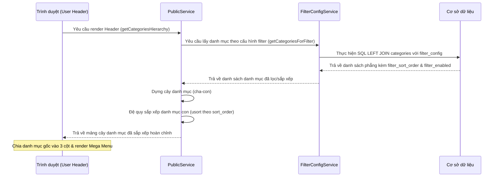

# HƯỚNG DẪN XÂY DỰNG HỆ THỐNG DANH MỤC ĐA CẤP, BỘ LỌC ADMIN VÀ MEGA MENU DYNAMIC (MVC - PHP)

Tài liệu này phân tích chi tiết và hướng dẫn cách xây dựng 3 tính năng liên kết chặt chẽ trong source code của dự án:
1. **Kiến trúc Danh mục Đa cấp** (Multi-level Category Architecture)
2. **Cấu hình Bộ lọc (Filter) tại Trang quản trị Admin**
3. **Sự ảnh hưởng của cấu hình Filter đến Thứ tự Hiển thị Mega Menu ở Header phía User**

Tài liệu được biên soạn dưới dạng cẩm nang kỹ thuật chi tiết để bạn có thể dễ dàng hiểu rõ bản chất, luồng hoạt động, cấu trúc MVC và áp dụng trực tiếp vào một hệ thống PHP MVC khác đơn giản hơn.

---

## PHẦN 1: TỔNG QUAN CÁC FILE LIÊN QUAN

Dưới đây là danh sách các file cấu thành nên các chức năng này và mục đích hoạt động của chúng:

### 1. Lớp Cơ sở dữ liệu (Database Schema)
*   **`database/migrations/043_create_filter_config_table.sql`**: 
    *   *Mục đích*: Định nghĩa cấu trúc của hai bảng `filter_config` (lưu chi tiết thứ tự & trạng thái bật/tắt của từng phần tử lọc) và `filter_settings` (lưu cấu hình chung của các tiêu chí lọc: danh mục, thương hiệu, khoảng giá).
*   **Bảng `categories`** (chứa cấu trúc danh mục):
    *   *Mục đích*: Lưu thông tin danh mục bao gồm `id`, `name`, `parent_id` (ID của danh mục cha), `slug`, `icon`, `color`, `sort_order`, `show_in_filter` và `type` (phân biệt danh mục sản phẩm và tin tức).

### 2. Lớp Model (Data Access)
*   **`app/models/CategoriesModel.php`**: 
    *   *Mục đích*: Xử lý các truy vấn SQL liên quan đến danh mục. Cung cấp hàm đệ quy để dựng cây danh mục phẳng thành cấu trúc lồng nhau (`buildTree`) và lấy toàn bộ ID danh mục con (`getAllChildCategoryIds`).
*   **`app/models/BaseModel.php`**:
    *   *Mục đích*: Lớp cha chứa các hàm tiện ích dùng chung (find, where, update, delete).

### 3. Lớp Service (Business Logic)
*   **`app/services/FilterConfigService.php`**:
    *   *Mục đích*: Trái tim xử lý logic của cấu hình bộ lọc. Đọc/Ghi dữ liệu cấu hình filter của danh mục, thương hiệu, khoảng giá từ database. Chịu trách nhiệm đồng bộ hóa thứ tự kéo thả từ giao diện admin vào bảng `filter_config`.
*   **`app/services/PublicService.php`**:
    *   *Mục đích*: Cung cấp dữ liệu cho các view phía User. Lớp này gọi `FilterConfigService` để lấy danh sách danh mục đã sắp xếp theo cấu hình của Admin, sau đó build thành cấu trúc cây đệ quy và sắp xếp các nhánh con trước khi đưa lên Header.

### 4. Lớp Controller / API Router
*   **`api.php`**:
    *   *Mục đích*: Router xử lý các yêu cầu AJAX gửi từ giao diện. Nhận request lưu cấu hình bộ lọc (`saveFilterConfig`), reset cấu hình (`resetFilterConfig`), hoặc lấy cấu hình (`getFilterConfig`), xác thực quyền Admin và gọi Service tương ứng xử lý.

### 5. Lớp View (User Interface)
*   **`app/views/admin/products/filter_config.php`** (Admin View):
    *   *Mục đích*: Giao diện kéo thả trực quan dành cho Admin. Sử dụng HTML5 Drag and Drop API kèm Javascript để sắp xếp vị trí các nhóm lọc (danh mục, thương hiệu, khoảng giá) và sắp xếp danh mục đa cấp theo đúng phân cấp cha-con.
*   **`app/views/_layout/header.php`** (User View):
    *   *Mục đích*: Đọc dữ liệu cây danh mục đã sắp xếp từ `PublicService`, render cấu trúc HTML Mega Menu lồng nhau (Parent -> Child -> Grandchild) dạng lưới (Grid) 3 cột cân đối và hỗ trợ Responsive Drawer trên mobile.

---

## PHẦN 2: CHI TIẾT TỪNG VẤN ĐỀ - CƠ CHẾ & LOGIC

### VẤN ĐỀ 1: KIẾN TRÚC DANH MỤC ĐA CẤP (MULTI-LEVEL CATEGORY)

#### 1. Kiến trúc Cơ sở Dữ liệu
Sử dụng mô hình **Adjacency List** (Danh sách kề). Mỗi danh mục lưu trữ một tham chiếu đến cha của nó thông qua cột `parent_id`.
*   Nếu `parent_id` bằng `0` hoặc `NULL` $\rightarrow$ Đây là danh mục gốc (Root / Parent).
*   Nếu `parent_id = X` ($X > 0$) $\rightarrow$ Đây là danh mục con (Child) của danh mục có `id = X`.

```
Bảng `categories`:
+----+----------------------+-----------+------------+--------------------+
| id | name                 | parent_id | sort_order | type               |
+----+----------------------+-----------+------------+--------------------+
| 1  | Thiết bị điện tử     | 0         | 1          | NULL (Sản phẩm)    |
| 2  | Điện thoại           | 1         | 1          | NULL               |
| 3  | iPhone               | 2         | 1          | NULL               |
| 4  | Thời trang           | 0         | 2          | NULL               |
| 5  | Tin công nghệ        | 0         | 1          | 'news' (Tin tức)   |
+----+----------------------+-----------+------------+--------------------+
```

#### 2. Logic Đệ Quy dựng Cây (Build Category Tree)
Khi lấy dữ liệu từ database, ta chỉ có một mảng phẳng (Flat Array). Để hiển thị đa cấp, Model (`CategoriesModel.php`) sử dụng hàm đệ quy để chuyển mảng phẳng thành dạng cây (Tree):

```php
public function buildTree($categories, $parentId = null, $maxDepth = 10, $currentDepth = 0, $visitedIds = []) {
    if ($currentDepth >= $maxDepth) return [];
    $tree = [];

    foreach ($categories as $category) {
        if ($category['parent_id'] == $parentId) {
            // Ngăn chặn Circular Reference (Tham chiếu vòng - lỗi vô tận)
            if (in_array($category['id'], $visitedIds)) {
                continue;
            }
            $newVisitedIds = array_merge($visitedIds, [$category['id']]);
            
            // Đệ quy tìm các danh mục con của danh mục hiện tại
            $category['children'] = $this->buildTree(
                $categories, 
                $category['id'], 
                $maxDepth, 
                $currentDepth + 1, 
                $newVisitedIds
            );
            $tree[] = $category;
        }
    }
    return $tree;
}
```

#### 3. Logic Lấy tất cả ID danh mục con (`getAllChildCategoryIds`)
Khi User nhấn lọc sản phẩm theo danh mục "Thiết bị điện tử" (id = 1), hệ thống phải hiển thị sản phẩm của cả "Điện thoại" (id = 2) và "iPhone" (id = 3).
Model cung cấp hàm đệ quy để thu thập tất cả ID con cháu:
*   Bắt đầu với danh mục cha hiện tại.
*   Tìm tất cả con trực tiếp $\rightarrow$ thêm vào danh sách ID.
*   Với mỗi con trực tiếp $\rightarrow$ tiếp tục gọi đệ quy để tìm cháu chắt và gộp mảng lại.

---

### VẤN ĐỀ 2: CẤU HÌNH FILTER Ở TRANG ADMIN

Tính năng này cho phép Admin điều chỉnh thứ tự hiển thị của các tiêu chí lọc chính, và thứ tự các item (danh mục, thương hiệu, v.v.) hiển thị trên sidebar lọc cũng như menu.

#### 1. Thiết kế Database Bộ lọc
*   Bảng `filter_settings`: Lưu các cài đặt tổng quan dưới dạng key-value. Ví dụ: thứ tự hiển thị của nhóm bộ lọc (`criteria_order`), trạng thái kích hoạt tiêu chí (`criteria_enabled`).
*   Bảng `filter_config`: Lưu trạng thái của từng item cụ thể.
    ```sql
    CREATE TABLE `filter_config` (
        `id` int(11) NOT NULL AUTO_INCREMENT,
        `criteria_type` enum('categories','brands','price_ranges') NOT NULL,
        `item_id` int(11) NOT NULL, -- ID từ bảng categories/brands/price_ranges
        `parent_id` int(11) NOT NULL DEFAULT 0, -- Dùng giữ cấu trúc cha con khi sắp xếp
        `sort_order` int(11) NOT NULL DEFAULT 0, -- Thứ tự sắp xếp do admin kéo thả
        `is_enabled` tinyint(1) NOT NULL DEFAULT 1,
        PRIMARY KEY (`id`),
        UNIQUE KEY `uk_criteria_item` (`criteria_type`, `item_id`)
    );
    ```

#### 2. Logic Kéo thả Phân cấp phía Client (Drag and Drop UI)
Tại view `filter_config.php`, giao diện kéo thả được chia làm hai chế độ (Mode):
1.  **Chế độ Cấp 1 (Criteria Level)**: Khi tất cả các nhóm filter đang thu gọn. Admin có thể kéo thả để đổi thứ tự giữa nhóm "Danh Mục", "Thương Hiệu" và "Khoảng Giá".
2.  **Chế độ Cấp 2 (Items Level)**: Khi một nhóm (Ví dụ: "Danh mục") được mở rộng. Giao diện sẽ khóa chức năng kéo nhóm lớn, chỉ cho phép kéo thả các danh mục con bên trong.
    *   *Ràng buộc đặc biệt*: Chỉ cho phép kéo thả các item **cùng cấp** với nhau (ví dụ: chỉ kéo thả các danh mục con trực tiếp của "Thiết bị điện tử" với nhau, không được kéo danh mục cấp 3 ra cấp 2). Điều này được kiểm soát bằng thuộc tính `data-parent`.

#### 3. Quy trình Lưu dữ liệu (AJAX & SQL)
Khi Admin nhấn "Lưu Cấu Hình":
1.  **Javascript quét DOM**: Thu thập thứ tự hiển thị hiện tại của các block dựa trên vị trí hiển thị vật lý trên màn hình:
    ```javascript
    // Javascript thu thập dữ liệu
    criteria.forEach((criterion, index) => {
        // Thứ tự nhóm (index + 1)
        config.criteria.push({ name: name, order: index + 1, enabled: isChecked });
        
        // Quét các item con trong nhóm
        const items = criterion.querySelectorAll('.criteria-item');
        items.forEach((item, itemIndex) => {
            config.items[name].push({
                id: item.dataset.id,
                parent_id: item.dataset.parent,
                order: itemIndex + 1, // Thứ tự mới sau khi kéo thả
                enabled: checkbox.checked
            });
        });
    });
    ```
2.  **Gửi API**: Gửi chuỗi JSON cấu hình lên `api.php?action=saveFilterConfig`.
3.  **Service xử lý lưu trữ (`FilterConfigService.php`)**:
    *   Lưu thông tin thứ tự nhóm vào `filter_settings`.
    *   Duyệt qua danh sách items, thực hiện câu lệnh SQL `INSERT INTO ... ON DUPLICATE KEY UPDATE` để cập nhật `sort_order` và `is_enabled` nếu bản ghi đã tồn tại, hoặc tạo mới nếu chưa có.

---

### VẤN ĐỀ 3: CÁCH CẤU HÌNH FILTER ADMIN ẢNH HƯỞNG TỚI THỨ TỰ MEGA MENU TRANG USER

Đây là phần kết nối quan trọng nhất. Thay vì Mega Menu tự hiển thị theo thứ tự mặc định của Database, hệ thống sẽ ưu tiên áp dụng thứ tự cấu hình filter của Admin để render giao diện.



#### 1. Logic Kết Hợp Dữ Liệu (SQL JOIN)
Trong `FilterConfigService::getCategoriesForFilter()`, câu lệnh SQL được tối ưu để lấy ra danh mục và liên kết với bảng cấu hình bộ lọc:
```sql
SELECT c.id, c.name, c.parent_id, c.icon, c.color, c.description,
       COALESCE(fc.sort_order, c.sort_order, 999) as filter_sort_order,
       COALESCE(fc.is_enabled, 1) as filter_enabled
FROM categories c
LEFT JOIN filter_config fc ON fc.criteria_type = 'categories' AND fc.item_id = c.id
WHERE c.status = 'active' AND c.show_in_filter = 1 AND (c.type != 'news' OR c.type IS NULL)
ORDER BY c.parent_id ASC, filter_sort_order ASC, c.name ASC
```
*   *Phân tích cốt lõi*: 
    *   `COALESCE(fc.sort_order, c.sort_order, 999)`: Lấy thứ tự từ cấu hình filter của admin trước (`fc.sort_order`), nếu admin chưa cấu hình thì dùng thứ tự mặc định của danh mục (`c.sort_order`), nếu không có nữa thì để cuối cùng (`999`).
    *   `COALESCE(fc.is_enabled, 1)`: Lấy trạng thái kích hoạt trong cấu hình filter. Nếu admin tắt danh mục này trong bộ lọc, nó sẽ không hiển thị trên menu.

#### 2. Dựng cây và Sắp xếp đệ quy (Recursive Sorting)
Sau khi `PublicService::getCategoriesHierarchy` nhận được dữ liệu phẳng từ Service, nó tiến hành:
1.  Dựng cấu trúc cha-con thông qua tham chiếu mảng (`&`).
2.  Sử dụng hàm đệ quy để sắp xếp toàn bộ danh mục con (Children) ở mọi cấp độ bằng hàm `usort` của PHP:
    ```php
    $sortChildren = function(&$categories) use (&$sortChildren) {
        foreach ($categories as &$category) {
            if (!empty($category['children'])) {
                // Sắp xếp các danh mục con dựa trên sort_order được cấu hình từ Admin
                usort($category['children'], function ($a, $b) {
                    $sortA = (int)($a['sort_order'] ?? 999);
                    $sortB = (int)($b['sort_order'] ?? 999);
                    if ($sortA === $sortB) {
                        return strcmp((string)$a['name'], (string)$b['name']);
                    }
                    return $sortA <=> $sortB;
                });
                // Đệ quy sâu xuống các cấp con tiếp theo (Grandchildren)
                $sortChildren($category['children']);
            }
        }
    };
    $sortChildren($hierarchy);
    ```

#### 3. Render Mega Menu ở View (`header.php`)
Để Mega Menu hiển thị đẹp mắt và cân đối (không bị cột quá dài, cột quá ngắn), hệ thống chia các danh mục cha vào **đúng 3 cột** bằng thuật toán chia dư đơn giản:
```php
// Chia đều danh mục cha vào 3 cột
$columns = [[], [], []];
$colIndex = 0;
foreach ($headerCategories as $parentCat) {
    $columns[$colIndex % 3][] = $parentCat;
    $colIndex++;
}
```
Sau đó, trong từng cột, hệ thống duyệt qua danh mục cha, tiếp tục duyệt qua danh mục con và danh mục cháu để render HTML tương ứng.

---

## PHẦN 3: BẢN THIẾT KẾ KIẾN TRÚC MVC

Dưới đây là sơ đồ ánh xạ 3 vấn đề trên vào mô hình kiến trúc **Model-View-Controller (MVC)** chuẩn:

```
                  +-----------------------------------+
                  |               VIEW                |
                  |  - admin/products/filter_config   |
                  |  - _layout/header (Mega Menu)     |
                  +-----------------------------------+
                        ^                       |
                        | (Hiển thị HTML)       | (Gửi AJAX/POST)
                        |                       v
         +-----------------------------+     +------------------------+
         |      PUBLIC SERVICE         |     |       API ROUTER       |
         |  - getCategoriesHierarchy() |     |  - api.php (Action)    |
         +-----------------------------+     +------------------------+
                        ^                               |
                        | (Gọi logic nghiệp vụ)          | (Gọi Controller/Service)
                        |                               v
                  +-------------------------------------------+
                  |                 SERVICE                   |
                  |  - FilterConfigService                    |
                  |    * getFilterConfig() / saveFilterConfig()|
                  +-------------------------------------------+
                                        |
                                        | (Yêu cầu dữ liệu DB)
                                        v
                  +-------------------------------------------+
                  |                  MODEL                    |
                  |  - CategoriesModel (buildTree)            |
                  |  - Database (bảng filter_config,...)      |
                  +-------------------------------------------+
```

---

## PHẦN 4: HƯỚNG DẪN ÁP DỤNG CHO HỆ THỐNG CỦA BẠN (BLUEPRINT)

Dưới đây là mã nguồn rút gọn, tối giản nhưng đầy đủ chi tiết giúp bạn áp dụng mô hình này vào hệ thống MVC PHP/SQL của riêng bạn.

### Bước 1: Tạo các bảng cơ sở dữ liệu
```sql
-- Bảng lưu danh mục
CREATE TABLE `categories` (
    `id` INT AUTO_INCREMENT PRIMARY KEY,
    `name` VARCHAR(255) NOT NULL,
    `parent_id` INT DEFAULT 0,
    `sort_order` INT DEFAULT 0
);

-- Bảng lưu cấu hình thứ tự bộ lọc do Admin sắp xếp
CREATE TABLE `filter_config` (
    `criteria_type` VARCHAR(50) NOT NULL, -- 'categories', 'brands'
    `item_id` INT NOT NULL,
    `sort_order` INT NOT NULL DEFAULT 0,
    PRIMARY KEY (`criteria_type`, `item_id`)
);
```

### Bước 2: Viết Class Model xử lý phân cấp danh mục
Tạo file `Model/CategoryModel.php`:
```php
class CategoryModel {
    private $db; // PDO connection

    public function __construct($pdo) {
        $this->db = $pdo;
    }

    // Lấy danh mục kèm thứ tự được cấu hình từ Admin
    public function getCategoriesForMenu() {
        $sql = "SELECT c.*, COALESCE(fc.sort_order, c.sort_order, 999) as custom_order
                FROM categories c
                LEFT JOIN filter_config fc ON fc.criteria_type = 'categories' AND fc.item_id = c.id
                ORDER BY custom_order ASC, c.name ASC";
        
        $stmt = $this->db->query($sql);
        return $stmt->fetchAll(PDO::FETCH_ASSOC);
    }

    // Hàm dựng cấu trúc cây (Tree)
    public function buildTree(array $elements, $parentId = 0) {
        $branch = [];
        foreach ($elements as $element) {
            if ($element['parent_id'] == $parentId) {
                $children = $this->buildTree($elements, $element['id']);
                if ($children) {
                    $element['children'] = $children;
                } else {
                    $element['children'] = [];
                }
                $branch[] = $element;
            }
        }
        return $branch;
    }
}
```

### Bước 3: Viết Controller xử lý lưu cấu hình Admin
Tạo file `Controller/AdminFilterController.php`:
```php
class AdminFilterController {
    private $db;

    public function __construct($pdo) {
        $this->db = $pdo;
    }

    // Endpoint nhận dữ liệu AJAX lưu cấu hình
    public function saveConfig() {
        // Nhận dữ liệu JSON từ Client
        $input = json_decode(file_get_contents('php://input'), true);
        
        if (!isset($input['items'])) {
            echo json_encode(['success' => false, 'message' => 'Dữ liệu không hợp lệ']);
            return;
        }

        try {
            $this->db->beginTransaction();

            $sql = "INSERT INTO filter_config (criteria_type, item_id, sort_order) 
                    VALUES (?, ?, ?) 
                    ON DUPLICATE KEY UPDATE sort_order = VALUES(sort_order)";
            $stmt = $this->db->prepare($sql);

            foreach ($input['items'] as $item) {
                $stmt->execute([
                    'categories',
                    $item['id'],
                    $item['order']
                ]);
            }

            $this->db->commit();
            echo json_encode(['success' => true]);
        } catch (Exception $e) {
            $this->db->rollBack();
            echo json_encode(['success' => false, 'message' => $e->getMessage()]);
        }
    }
}
```

### Bước 4: Viết giao diện Kéo thả ở phía Admin (HTML & JS)
Trong view cấu hình của Admin, render danh sách danh mục phẳng:
```html
<ul id="drag-list">
    <?php foreach($categories as $cat): ?>
        <li class="drag-item" data-id="<?= $cat['id'] ?>" draggable="true">
            <span class="handle">☰</span> <?= htmlspecialchars($cat['name']) ?>
        </li>
    <?php endforeach; ?>
</ul>
<button id="btn-save">Lưu thứ tự</button>

<script>
const dragList = document.getElementById('drag-list');
let dragSrcEl = null;

// Thêm sự kiện drag cho các item
document.querySelectorAll('.drag-item').forEach(item => {
    item.addEventListener('dragstart', function(e) {
        dragSrcEl = this;
        e.dataTransfer.effectAllowed = 'move';
    });
    
    item.addEventListener('dragover', function(e) {
        e.preventDefault();
    });
    
    item.addEventListener('drop', function(e) {
        e.preventDefault();
        if (dragSrcEl !== this) {
            // Đổi chỗ phần tử trong DOM
            let rect = this.getBoundingClientRect();
            let next = (e.clientY - rect.top) / (rect.bottom - rect.top) > 0.5;
            dragList.insertBefore(dragSrcEl, next ? this.nextSibling : this);
        }
    });
});

// Sự kiện bấm nút Lưu
document.getElementById('btn-save').addEventListener('click', function() {
    const items = [];
    document.querySelectorAll('.drag-item').forEach((item, index) => {
        items.push({
            id: parseInt(item.dataset.id),
            order: index + 1
        });
    });

    fetch('/admin/filter/save', {
        method: 'POST',
        headers: { 'Content-Type': 'application/json' },
        body: JSON.stringify({ items: items })
    })
    .then(res => res.json())
    .then(data => {
        if(data.success) alert('Đã lưu thứ tự hiển thị!');
    });
});
</script>
```

### Bước 5: Render Mega Menu phía User
Tại file `header.php` hoặc Controller điều phối View của trang chủ:
```php
// 1. Khởi tạo Model & Lấy dữ liệu đã sắp xếp
$categoryModel = new CategoryModel($pdo);
$rawCategories = $categoryModel->getCategoriesForMenu();

// 2. Chuyển mảng phẳng thành cây danh mục lồng nhau
$categoryTree = $categoryModel->buildTree($rawCategories, 0);

// 3. Render HTML cấu trúc Mega Menu
function renderMegaMenu($tree) {
    echo '<ul class="menu-level-1">';
    foreach ($tree as $parent) {
        echo '<li>';
        echo '<a href="/category?id=' . $parent['id'] . '">' . htmlspecialchars($parent['name']) . '</a>';
        
        // Nếu có danh mục con thì render cấp tiếp theo
        if (!empty($parent['children'])) {
            echo '<ul class="menu-level-2">';
            foreach ($parent['children'] as $child) {
                echo '<li>';
                echo '<a href="/category?id=' . $child['id'] . '">' . htmlspecialchars($child['name']) . '</a>';
                
                // Hỗ trợ đến cấp 3 (Cháu)
                if (!empty($child['children'])) {
                    echo '<ul class="menu-level-3">';
                    foreach ($child['children'] as $grandchild) {
                        echo '<li><a href="/category?id=' . $grandchild['id'] . '">' . htmlspecialchars($grandchild['name']) . '</a></li>';
                    }
                    echo '</ul>';
                }
                echo '</li>';
            }
            echo '</ul>';
        }
        echo '</li>';
    }
    echo '</ul>';
}

// Gọi hàm render trong layout header
renderMegaMenu($categoryTree);
```

---

## TỔNG KẾT BÀI HỌC KINH NGHIỆM CHO HỆ THỐNG MỚI
1.  **Dùng liên kết ngoài (`LEFT JOIN`) với bảng cấu hình**: Giúp dữ liệu gốc (bảng `categories`) độc lập với giao diện hiển thị. Admin có thể thay đổi thứ tự menu hàng ngày mà không cần cập nhật trực tiếp vào cột `sort_order` của bảng gốc $\rightarrow$ Tránh lỗi phân rã liên kết dữ liệu.
2.  **Đệ quy đi đôi với kiểm soát vòng lặp (Circular Reference check)**: Khi làm việc với danh mục cha-con lưu chung một bảng, nếu vô tình thiết lập A là cha của B và B lại là cha của A, hàm đệ quy sẽ chạy vô chậm và làm treo server. Luôn luôn duy trì mảng `visitedIds` để phát hiện và ngăn chặn kịp thời.
3.  **Lưu trữ dạng Key-Value cho cấu hình linh động**: Bảng `filter_settings` lưu key-value giúp bạn dễ dàng mở rộng các tính năng cấu hình khác trong tương lai mà không cần phải thay đổi cấu trúc Database (Alter Table).
4.  **Tách biệt logic dựng cây và render HTML**: Hãy luôn chuyển đổi mảng phẳng thành mảng cây lồng nhau (Tree Array) trong Controller/Service trước khi truyền sang View. Điều này giúp code View cực kỳ sạch sẽ, chỉ tập trung vào việc hiển thị thẻ `<ul>`, `<li>` và CSS.

> [!NOTE]
> Bản thiết kế trên có thể áp dụng tương tự cho các thành phần lọc khác như **Thương hiệu (Brands)** hoặc **Nhóm tin tức (News Categories)** bằng cách cấu trúc lại `criteria_type` trong bảng cấu hình bộ lọc.
